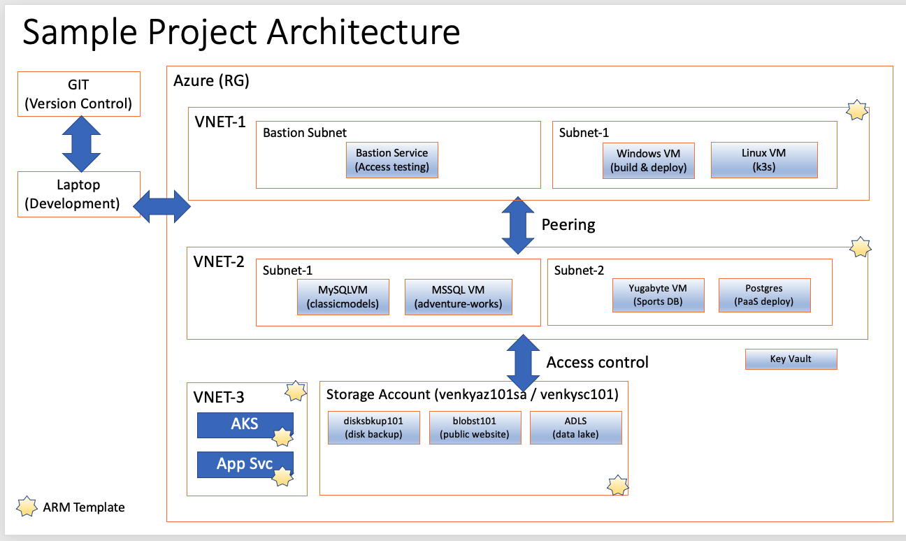

# Azure-AZ-104

This project shows some of the experiments we can do to get familiar with the aspects tested on the AZ-104 exam. Lot of fun things to create here and get our hands dirty! 

  

Here are the steps:

0. Create the storage account using the 1000-Create-Storage.ps1.
0.1 - Upload the install-yugabyte.sh to the venkyinitscr101/initsh101 container. This is referenced by the startup script that is used with the yugabyte VM. So, please make sure this is in place. Can automate further to make it azcopy into the right location.
1. Run the 1001-Create-K3s-Cluster.ps1. This will create 4 VMs. One windows machine with a public IP that acts as a gateway. The other 3 ubuntu machines will become part of a k3s cluster. We have to do a manual install of k3s following the steps in the install-k3s-master.sh. 
2. We will create another ubuntu VM, and install Yugabyte 3 node cluster using the init scripts. We will need to upload the scripts needed to the storage account, and reference it via the arm script. Better to do this manually once rather than using ARM template to get practice.
3. We will peer the vnet 1 to vnet 2 and check the peering status on the Peering left menu option on each of the subnets. it should show connected on both of them.
4. Once the peering is good to go, we should be able to go to this URL from the win-entry VM to make sure that the yugabyte is installed via the custom scripts the way we want.
5. In the win-entry vm, here is the path 
    /var/lib/waagent/custom-script/download/0/yugabyte-2.13.2.0/bin#
5.1 Check the yugabyte installed here.
  /var/lib/waagent/custom-script/download/1/yugabyte-2.13.2.0/    
5.2. Do a ps -ef | grep yuga to make sure the processes are running fine.
6. We will use ACI to push container with H2 for initial test. 1007 Script
7. We will use ACI to push the yugabyte spring app to test 1008 script.
    http://venkyybtest.<region>.azurecontainer.io:8080/loaddb?amount=100 - Create 100 recs in yugabyte database.
    http://venkyybtest.<region>.azurecontainer.io:8080/showdb?page=0 - Show the data in the database. This demonstrates spring boot yugabyte

6. We will deploy a spring boot app on the k3s cluster that will talk to this Yugabyte DB, and test it out.

