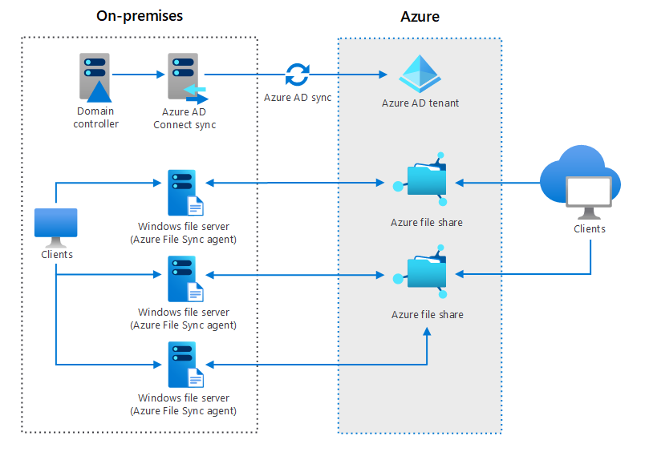

---
casestudy:
    title: 'Design a non-relational storage solution'
    module: 'Non-relational storage solutions'
---
# Design Non-relational Storage Case Study

## Requirements

Tailwind Traders wants to reduce storage costs by reducing duplicate content and, whenever applicable, migrating it to the cloud. They would like a solution that centralizes maintenance while still providing world-wide access for customers who browse media files and marketing literature. Additionally, they would like to address the storage of company data files. 

 

* **Media files**. Media files include product photos and feature videos that are displayed on the company’s public website, which is developed and maintained in house. When a customer browses to an item, the corresponding media files are displayed. The media files are in different formats, but JPEG and MP4 are the most common. 

* **Considerations**
    * Media files are being served to customers of the website. Since these files need to be served at scale, it is better to host them in a blob storage account. Since the website can be accessed from any geographic location, it is better to store the files in a RA-GZRS / RA-GRS type storage. As an additional performance booster we can consider using a CDN to cache files at the edge. 
    * It says that most of the files are JPEG and MP4. It is definitely possible that non-standard formats need to be detected, and possibly converted or scaled based on standards. This can be achieved using events from the storage account, and triggering functions to do the reformats. 

* **Marketing literature**. The marketing literature includes customer stories, sales flyers, sizing charts, and eco-friendly manufacturing information. Internal marketing users access the literature via a mapped drive on their Windows workstations. Customers access the literature directly from the company’s public website.

* **Considerations**
    *  Since the internal marketing users access the files via a mapped shared drive, we can port this to use Azure File Shares and Azure File Sync. This architecture will allow the users to cache commonly used files in the company's File Sync Server End-point. Files are synchronized to the cloud File storage and allows for complex DR scenarios. Since these files eventually need to be exposed in the website, it is better to have a workflow to transfer the approved files to the blob storage similar to media files. 

* **Corporate documents**. These are internal documents for departments such as human resources and finance. These documents are accessed and managed via an internally developed web application. Legal requires that various documents be retained for a specific period of time. Occasionally documents will need to be maintained longer when legal or HR issues are being investigated. Most corporate documents older than one year are only kept for compliance reasons and are seldom accessed.

* **Considerations**
    *  Since there is a need for tiered storage to save on costs, it is better to host this in a general purpose v2 account with blob storage kind. This type of storage will allow for older files to be migrated from hot to cool to archive tier using life-cycle rules. 
    * There is mention of putting legal holds and time based retention policies and both of these are supported in this type of storage. Note that for files that are needed to be stored long term for legal reasons, we need to have a legal hold type of immutable configuration (WORM policy and that is locked).
    
* **File location**. All the files are stored locally in the main office data center. There are numerous file shares organized by department or product line. The data servers are struggling to provide files for the website. During peak hours website pages are slow to render. 

* **Considerations**
    *  This use-case is a perfect fit for Azure file shares and Azure File Sync agent deployment.
     
* **File access frequency**. Some products are more popular, and that data is accessed more frequently. However, some products, like ski gear, are only accessed during that season. Sales events generate a lot of interest in certain on sale items. 

	* We can save some costs for the low access items by putting them in the cool tier. The access costs are a little higher, but since they are not accessed a lot, we might realize some cost savings.
	
## Tasks

1. Design a storage solution for Tailwind Traders. 

      * What type of data is represented? 
	      * Most of the website related data is public facing and needs some kind of CDN to deliver optimally to end-users. Other types of data are internal and might need some kind of protection from external access.

      * What factors will you consider in your design?
		* Blob storage allows us to scale to high storage volumes. 

      * Will you use blob access tiers?
	      * Can save some money using tiers for old files that are not accessed as much.

      * Will you use immutable storage?
	      * Yes for meeting legal hold requirements. 

      * How will the content be securely accessed?
	      * Storage containers can be marked for private access and managed identities can be provisioned for the internal web app that is accessing this data. Access can be granted only from certain IP ranges to make it not accessible from internet.

2.  Your solution should consider the media, marketing literature, and corporate documents. Your recommendations may be different depending on the data. Be prepared to discuss your decisions. 
	* One size does not fit all these documents. File shares can be integrated to Azure AD to allow for group based access control to certain folders in the file share. 

How are you incorporating the Well Architected Framework pillars to produce a high quality, stable, and efficient cloud architecture?
