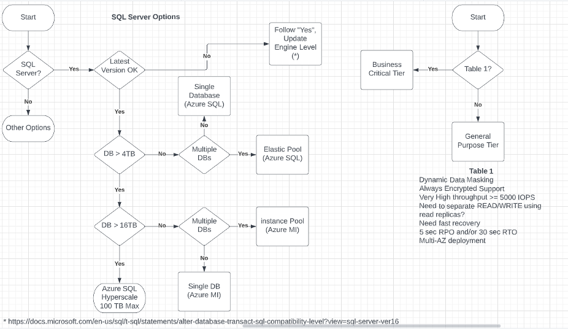
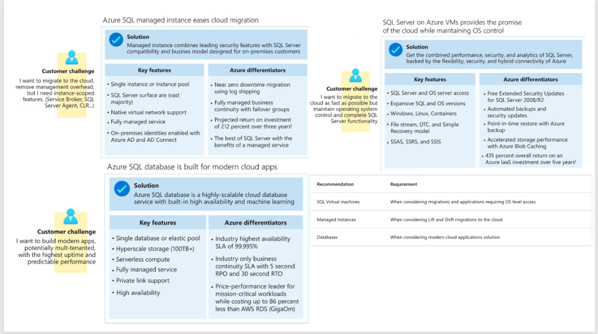

---
casestudy:
    title: 'Design a relational storage solution'
    module: 'Relational storage solutions'
---
# Design Relational Storage Case Study

## Requirements

Tailwind Traders is looking to move their existing public website database into Azure, as the website front end is being moved there as well.  The website front end will initially only be deployed in 2 regions for redundancy.  However, it is expected that as traffic increases the website will be replicated to other regions around the world. The database, which you are being asked to migrate, holds the product catalog, and all online orders.  Currently the database runs on a single Microsoft SQL Server Always On availability group on premises.

Primary concerns of Tailwind Traders:

-	**High availability.**  A primary concern for Tailwind Traders is that this database be highly available as it is critical to their business.  Any outages may result in lost sales or customer confidence.

-	**Website performance.**  While the performance of placing orders is normally satisfactory, browsing or searching pages with many items listed is reported as being “sluggish.”

-	**Security.**  Tailwind Traders is very concerned about personal or financial information stored in the database being exposed.  In addition to implementing proper security measures, the security team needs to verify that industry standard best practices are implemented, when possible.

## Tasks

1.	Design the database solution. Your design should include authorization, authentication, pricing, performance, and high availability. 
2.	Diagram what you decide and explain your solution. 

How are you incorporating the Well Architected Framework pillars to produce a high quality, stable, and efficient cloud architecture?

## Solution 
The website is going to be hosted on at least 2 regions to start with, and it is possible that the web application is going to get hosted on multiple regions as the company expands. This would imply that we will need to consider some kind of a HA database solution around SQL Server as mandated by the problem statement. 

Once we evaluate the options available in SQL Server, it is clear that we will need to employ either geo-replication or Active failover groups. The active failover groups is a better option here since the failover of the database will be automatic. Azure gives us a primary end-point that will allow applications to read-write, and another end-point - the secondary one, that will allow us to use it as a read replica. When failover occurs the DNS switching is taken care of by Azure and we do not have to do much. 

As we can see from the problem statement, the complaint is that the website seems sluggish sometimes. This could be remedied using some kind of a cache layer like Redis to get the data closer to the application when it is serving it. We could also target the read replica for the read only use-cases where we pull the data from the database and show it on the website. 

From a security perspective, we have many options to consider. If nothing special is needed, and the database is needed to be encrypted at rest, we can enable TDE. Customer manged keys can be even leveraged in case additonal security is needed. TLS can be forced when connecting to the database to make sure that encryption is enabled even in transit. Firewall rules can be setup at the SQL Server level to make sure that no public access is allowed to the database, and only the webservers can connect to the database. If there is a need to "hide" some columns, then we can enable dynamic data masking. Admins can see the full data, while lower power users can see masked versions of the data. If higher level security is needed, then we can enable Always Encrypted with keys stored in a key vault. The application can connect to th ekey vault using managed identity and get the keys to decrypt the column data. 

