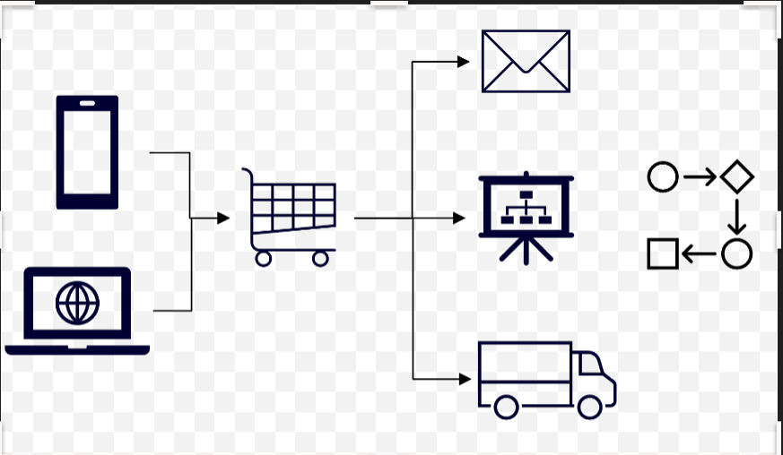

---
casestudy:
    title: 'Design an app architecture solution'
    module: 'App architecture solutions'
---
# Design an app architecture solution

## Requirements

Tailwind Traders is looking to update their website to include customer supplied product images in addition to the already existing photos provided by marketing. They believe that having more photos of products in use will give potential customers a better feel for how past customers loved their products after purchasing them. They do have some requirements as outlined below:

* Uploaded images will need to be scanned before getting posted on the website. Legal and Marketing are both requesting that after initial upload, the images be checked for any issues that reflect poorly upon the company or could cause legal issues. An in-house API has already been developed and deployed that can perform the necessary scanning. 
    * The website is being updated to give image upload functionality to the users. Once the user uploads the images to the system, we need to store it in a staging blob storage location where we can investigate it further. Since the upload has to start off the investigation process, we are looking at some kind of an eventing and workflow system. This workflow should be capable of calling the in-house developed API and decide the next course of action based on what the API returns. All of this hints to using a logic apps process that gets triggered based on events generated on blob storage.
    * As shown in the diagram below, we can see that blob storage can fire events into an event grid. A logic app can be triggered based on this event. 
    * 

* Based on existing patterns, Tailwind Traders expects the image uploads to happen very unevenly throughout the day. Certain periods may experience more uploads than the scanning software can handle, while other periods may experience very few or no uploads.

* Once an uploaded image has been scanned and approved by the system, Tailwind Traders would like for the customer to be sent an email thanking them for sharing their image.

* Cost and management of the solution is a concern, especially since Tailwind Traders isn’t sure how popular this feature will be initially. Minimize costs and leverage serverless solutions where possible.

 

 

## Task

Design an architecture for the customer images to be added to the company website. 

* Where should the images be stored?

* How will you ensure that all images are scanned even when uploads are outpacing scanning?

* Once images are approved and the catalog database is updated, how will the customer be notified? 

How are you incorporating the Well Architected Framework pillars to produce a high quality, stable, and efficient cloud architecture?

 
