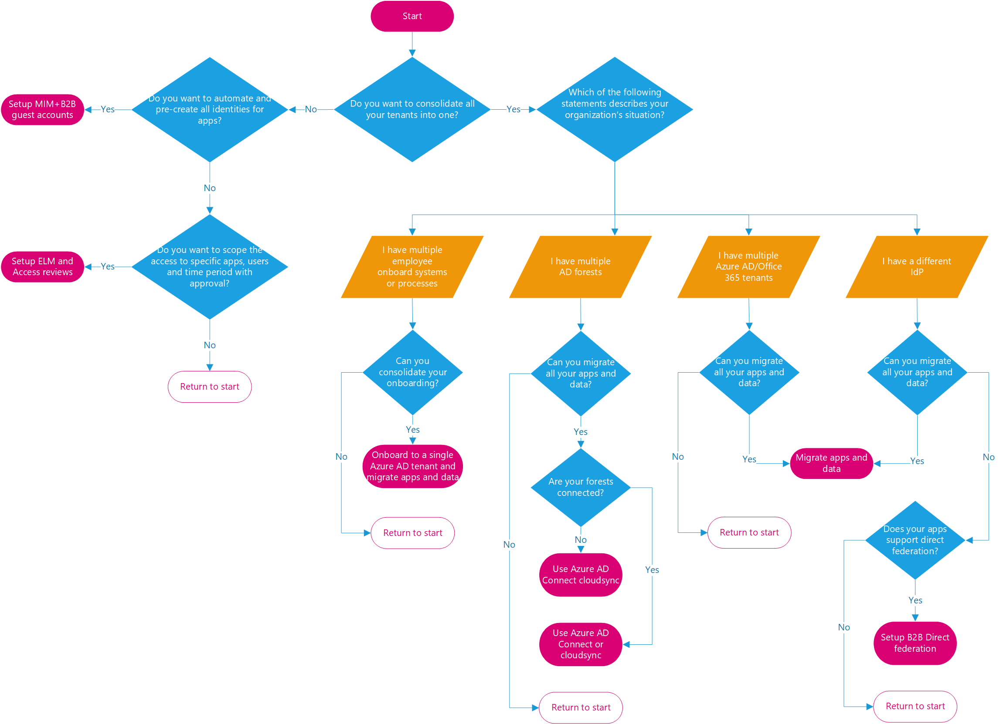
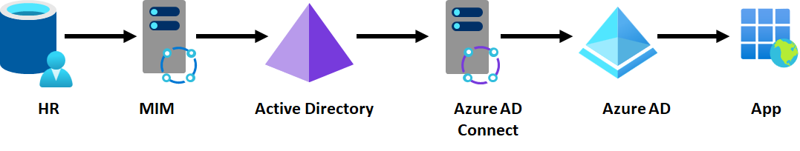
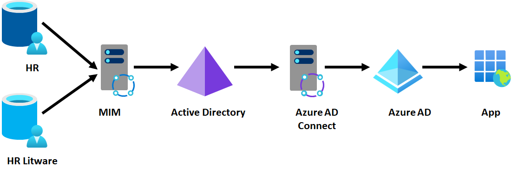
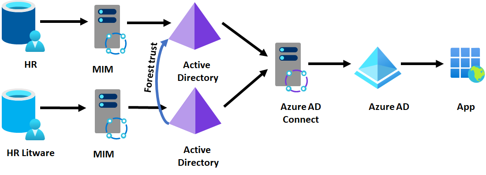
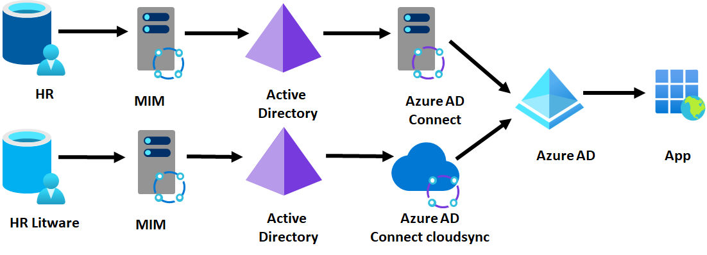

---
casestudy:
    title: 'Design authentication and authorization solutions'
    module: 'Authentication and authorization solutions'
---

# Design authentication and authorization solutions

## Requirements

Tailwind Traders is doing very well and is expanding their workforce. They have successfully acquired an online retailer in the sports apparel space. The company has also located a partner to outsource marketing literature. Tailwind Traders is using Azure Active Directory for user and groups accounts. Here are two specific initiatives the IT department would like you to help with. 

**New user accounts**

  * The online retailer acquisition will add 75 employees to Tailwind Traders. All the new users have on-premises Active Directory Domain Services accounts in the retailer’s existing domain.
    * The bottom section details the decision tree to determine that best course of action when mergers happen. Let us make our solution simple and say that after the merger is done, we want to handle all the identity on tailwind side, and decomm the hardware used for identity management at the online retailer side. 

  * The new marketing partner will initially have 15 employees who will need corporate access. These employees already have Azure AD accounts in the partner’s AAD tenant. 
    * This is a use-case where we are collaborating with an external partner. Since these users are outside of the company, it is best to integrate them into our AD via B2B collaboration and guest accounts. We send invites to them so that they can use their credentials to sign-in, and they will be loaded as guest accounts in our AD. We can group these users into a separate group and assign them access to the required apps to do their work using RBAC roles.

  * The new employees are located at various geographic locations and will need account privileges for their new job roles. Some changes to existing employee roles are expected. 
    * Since the users are there in multiple locations and might work in different circumstances, we will need to leverage AD conditional access policies. If we see that the user risk, sign-in risk is above acceptable limits we can allow/block access based on MFA. 
    * We can leverage identity protection to make sure compromised passwords, and brute force attacks are stopped. 
    * We can leverage PIM to make sure that priviledged users do not have access to their power at all times. A workflow might be initiated to approve the super user roles as needed. 
    * If we are leveraging VMs etc. then we can also enable JIT access so that NSGs are locked down. 

  * The IT department wants to take this opportunity to include new identity security features. 

**New application access**

  * The business development team has an application running an on Azure VM and data stored in an Azure SQL database. They need to securely allow the VM to query the Azure SQL database. 
    * Multiple options are available here. We can create a managed identity to the virtual machine running the app. We can have that managed identity access to the SQL server database. We can also make sure that we connect to the SQL database via a service end-point. This will make sure that the traffic will flow over the microsoft backbone network. 
  * They also need an on-premises server to be able to securely access the SQL database without storing credentials in the application code or configuration files.
    * The on-premise server needs to connect to the Azure SQL database. If we are allowed to connect from over the public internet, we need to make sure that the firewall for the sql server hosting the database allows the range of IPs that the on premise network uses. 
    * Since we need to make sure that the username/password should not be in config files we will need access to a key-valult to hold these secrets. Access needs to be granted to this key-vault to allow the app running on the on-premise server to get these secrets at runtime.

## Tasks

**New user accounts**

  * Diagram the process for bringing in the acquired user accounts.

  * Diagram the process for adding the new partner accounts. 

  * For the above requirements, be sure to include any tools that will be used. List at least three benefits of your suggested solution. 

* Provide at least three recommendations for improving Tailwind Traders user identity solutions. Rank the recommendations in order of importance. Include your reasons for making these suggestions. 

**New application access**

  * Provide an access solution for the business development application.

  * Provide an access solution for the on-premises resources.

How are you incorporating the Well Architected Framework pillars to produce a high quality, stable, and efficient cloud architecture?

## Solution 
* The decision tree helps us understand the options we have for handing the use-case. Detailed discussion can be seen here - https://learn.microsoft.com/en-us/azure/active-directory/fundamentals/azure-active-directory-parallel-identity-options

* Here are the various ways we can visualize how to bring the users from the acquision over to the Azure AD.

* This is where we start off with. This is the parent company and it is using the Azure AD and on-premise AD integration via the Azure AD connect. 

* This is where we start off with. This is an option where we take the back end systems of both the companies and merge them to the same Azure AD. This approach will need connectivity from the acquired org to connect to the parent company to sync via the AD connect that is shared. Also the identities will remain distinct across the companies as no consolidation is happening in this. 

* This is an option to pursue if we do not want to keep the two company infrastructures. If we see this we establish a trust relationship between the two on-premise AD forests.  

* This is an option to pursue if we do not want to keep the two company infrastructures. The child company is using AD connect cloud sync option.  

