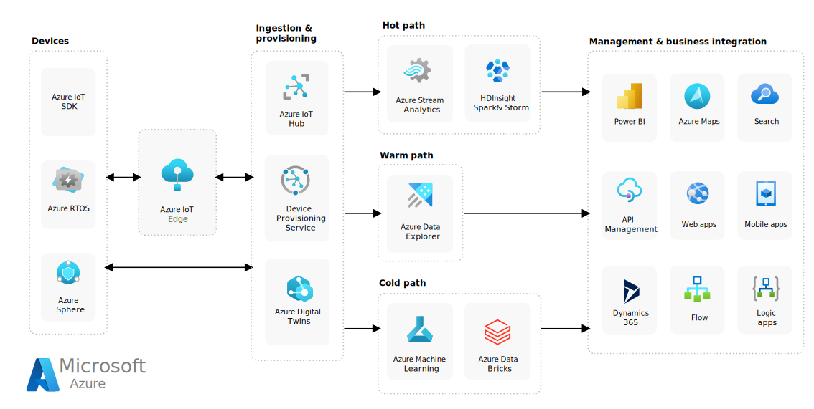

---
casestudy:
    title: 'Fabrikam Residences'
    module: 'Logging and monitoring solutions'
---
# Case Study: Fabrikam Residences

## Requirements

**This case study requires you to have completed the following modules and case studies:  Compute, relational data, non-relational data, authentication, application architecture**

You have taken a new position with Fabrikam Residences, which is very successful and is experiencing rapid growth. Fabrikam Residences is a building contractor for new homes and major home renovations and have become successful by providing quality buildings and offering newer integrated home technologies than their competitors.  

Currently these technologies are provided and managed by separate sub-contract companies. The owners of Fabrikam Residences want to begin offering these upgraded technology options in-house to provide better quality, support and data on customer patterns and needs. 
 
Initially, the company wants to offer HVAC (heating and cooling) control and monitoring, security system monitoring and alerts, and home automation. This will require a new website, data storage solution and data ingestion solution.
  * Lots of hints towards a proper IoT solution.

The company has seen tremendous growth over the past 2 years. The company is estimating it may double in size over the next 12-18 months. With such rapid growth in the regional market, the company has no current plans to expand outside of the regional market.
  * Single region scope is enough for now, but with complementary technologies like Azure site recovery, this can be converted into an active / DR solution in the future. 

## Current Situation

The Fabrikam Headquarters operates a small datacenter in a single location. The datacenter hosts the company **Project Management (PM) software**.

- The PM software uses a third-party Windows application. The application runs on a 2-node Network Load Balancing (NLB) cluster with a single Microsoft SQL Server backend.  
  * Since it is a custom software install, we need to think of Virtual machines when we move to Azure.
  * Since we are using a network load balancer on-premise, we can consider using a level 4 load balancer like Azure Load Balancer inside Azure. Level 7 capabilities are not required for now. 
  * Microsoft SQL Server is the back-end. We can move to Azure SQL if there are no pressing limitations of a speciic version needed. If a specific version is needed, then we have to use either VMs or SQL Managed instance. 

- Images and documents are stored on a mapped drive of the server, which resides on a dedicated NAS appliance.
  * Since we need the functionality of regular files, and shares with potential authorizations by folder etc. it is better to plan for Azure Files. If we want to have active synchronizations from other file servers, we can plan to use Azure File Sync. Since there is no need to expose this to external customers on the website, there is no need for blob storage for this use-case.

- Corporate users, office staff, use a web front end to enter data such as supply delivery schedules and change orders.
  * It is hard to understand this piece. I am assuming that this is part of the PM Software itself, and it has custom functionality that can be reached to enter the data. If this is the case, we do not have much options available from a migration perspective. We need to host these VMs based on a custom image we create. This can be spawned over 2 AZs using a VMSS, so that the availability is drastically increased when compared to the on-premise case where we have just 2 nodes.

-	Field superintendents use Windows laptops and tablets offline to continuously record building progress and other details.  These changes, such as new work orders, are stored in a local change file .  At the end of each day, superintendents return to the office to connect to the wireless network and run a small script to upload the change file to an FTP server.  A second script is scheduled to run each night to processes all the change files and enter their contents into the Project Management database (Microsoft SQL Server).
  * This can be handled in multiple ways. There are products that can allow agents to be deployed in each laptop that can sync the files from the laptop to a centralized share. https://www.resilio.com/blog/local-desktop-file-caching-with-azure-files-for-remote-work 
  * If this is not an option, then we might have to use SMB 3.0 to connect these laptops to the Azure file share and tweak the scripts to check and upload the files generated in each laptop to the file share. AZcopy can copy the files from the local laptop to the Azure file share. SAS tokens are usually used in such scenarios but security might be a concern with this topology.

The **Home Technology software** is currently provided and hosted by third parties and involves at least three different websites the customer must visit.  It is proposed the software be replaced with an in-house developed and unified solution.

## Requirements 

**Project Management software**

- Migrate as many of the systems to a public cloud provider as possible.
  * VMs are moved to azure.
  * SQL Server is moved to azure.
  * The NAS has been replaced with azure files. 
  * The FTP server is replaced with either special agents that can sync from computer to azure files, or we use smb 3.0 to copy files from local to azure files via azcopy. 
  * Most of the infra on-premise can be removed with this approach. 

- Replace the existing scripts to leverage a system more secure than FTP, as security concerns have arisen. Also, you have been asked to make sure that change files are processed as soon as they are uploaded.
  * This is a tricky requirement. There are no events that can be fired from an Azure file share when new files are landed. There is a feature request that has been raised with microsoft and it is pending. If this is not possible, one option that has been suggested is to use logic app with a re-occurance trigger to repeat every so often and scan for new files in the share. 
  * Another home grown alternative could be to fire a webjob with the name of the file that was uploaded and that can take care of the ingest process.

- Increase the resilience of the project management database. While performance is not an issue, the company would like to avoid losing access to the database in case of a single hardware failure.
  * We can choose business critical tier for the SQL Server we are using, and this should take care of this issue. 

**New Home Technology Solution**

- Add a new solution to collect data continuously from the home monitoring sensors.
  - Database some sensor readings for trend analysis and reporting.
  - Provide configurable real-time alerting based on owner needs.
  
- Design a relational database solution to hold homeowner preferences and settings.
  - System must be scalable.
  - Redundancy is critical.
  
- The new unified website will be developed in house and hosted on Linux.  This website will be used to view monitors and change preferences for items such as temperature or alert thresholds. Loads can vary widely, and the system must be able to scale quickly.

-	Provide users a way to sign into the system without creating another user account and password.

- Implement security controls and provide weekly reports outlining how the company matches up against industry standard best practices.

## Tasks 

1. Design a solution for the Project Management software. Be prepared to explain why you chose each component of the design and how it meets the solution requirements.

2. Design an architecture for the New Home Technology Solution. Be prepared to explain why you chose each component of the design and how it meets the solution requirements.

How are you incorporating the Well Architected Framework pillars to produce a high quality, stable, and efficient cloud architecture?

## IOT Reference Arch

