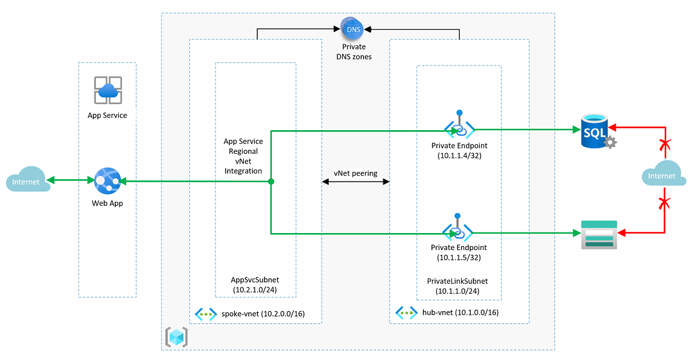

# Design a network infrastructure solution  

## Requirements

As the Tailwind Traders Enterprise IT team prepares to define the strategy to migrate some of company’s workloads to Azure, it must identify the required networking components and design a network infrastructure necessary to support them. Considering the global scope of its operations, Tailwind Traders will be using multiple Azure regions to host its applications. Most of these applications have dependencies on infrastructure and data services, which will also reside in Azure. Internal applications migrated to Azure must remain accessible to Tailwind Traders users. Internet-facing applications migrated to Azure must remain accessible to any external customer. 

To put together the initial networking design, the Tailwind Traders Enterprise IT team chose two key applications, which are representative of the most common categories of workloads that are expected to be migrated to Azure.  

### Design - Product catalog enterprise application

- An internet-facing, Windows-based two-tier .NET Core-based web app providing access to the product catalog, hosted in a SQL Server Always On Availability Group database. This application is categorized as mission-critical, with availability SLA of 99.99%, 10-minute RPO and 2-hour RTO. 

-	Business leads emphasize the importance of the optimal customer experience when accessing internet-facing apps, so it is critical that the time it takes to load web pages and download static content is minimized. Similarly, a failure of individual servers hosting web app components and their dependencies should have negligible impact on the web app availability perceived by customers. While it’s understood that a regional failure might introduce some interruption to existing web sessions, the failover to a disaster recovery site should be automatic.

- To take advantage of benefits offered by Azure PaaS services, the Enterprise IT team decided to implement the database of the product catalog enterprise application by using Azure SQL Database. 

- The Tailwind Traders Information Security and Risk teams require all communication between Azure VMs and PaaS services that are part of the same application must travel via Azure backbone, rather than via a public endpoint of the PaaS services. 

## Tasks - Product catalog enterprise application

1. Design a two-tier network solution for the Product Catalog. Where appropriate your design could include Azure Front Door, WAF, Azure Firewall, and Azure Load Balancer. Your networking components should be grouped into virtual networks and network security groups should be considered. Be prepared to explain why you chose each component of the design. 

How are you incorporating the Well Architected Framework pillars to produce a high quality, stable, and efficient cloud architecture?

## Solution 

* The requirements state that this is a very critical application for the enterprise that has very strict RPO and RTO values. Also the SLA desired is 99.99. This makes it an application that has to be deployed in multiple regions. 
* If we see the architecture proposed above, it is clear that we are using App Service VNET integration to make the communication from the app service and the Azure SQL database go over the Azure backbone. 
* The storage account provisioned will have a container to store the static content that is used in this web application. This communication between the app service and the blob storage also goes over the private network. 
* If the database peformance is not acceptable for certain complex query patterns, we can use a Redis cache in this solution to allow the data to get closer to the application, and not require repeated complex queries to the database backend. 
* CDN can also be integrated to this solution to make the static content get served to users from edge locations that are closer to them. 
* Since the deployment has to be done in two paired regions, usage of the Azure Front Door makes perfect sense. It is a level 7 application load balancer and can be configured to do priority based routing to the primary location. If the primary location fails, the users are sent to the secondary location. 
* WAF can be applied to the Azure Front door to make sure we are protected from the common web application based vulnerabilities. (OWASP).
* The Azure SQL database will need to have the business critical tier to get faster responses and additional read replicas. 
* The primary database and the secondary database in the second region can be a part of the auto failover group to enable fast failovers if the primary region / database fails for some reason. 
* App services are not zone redundant in every region. Given the high SLA requirement, we need to provision the app service to be zone redundant. 

## Alternative
* As an alternative to having an App service and configuring the regional VNET integration, we can use the ASE (App Service Environment) and an Azure SQL Managed instance. These get deployed natively into our VNET.
* This option is a little more expensive.

* Solution influenced heavily by these articles
* https://learn.microsoft.com/en-us/azure/architecture/example-scenario/private-web-app/private-web-app
* https://learn.microsoft.com/en-us/azure/architecture/reference-architectures/app-service-web-app/multi-region
* https://learn.microsoft.com/en-us/azure/architecture/reference-architectures/app-service-web-app/zone-redundant
