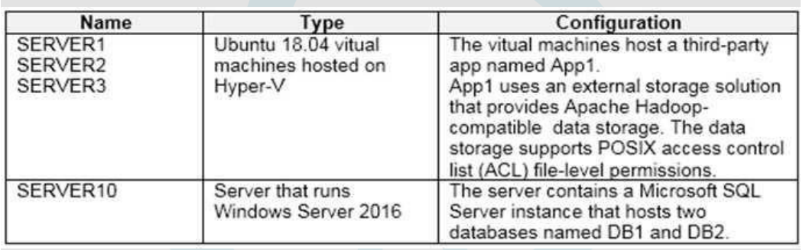
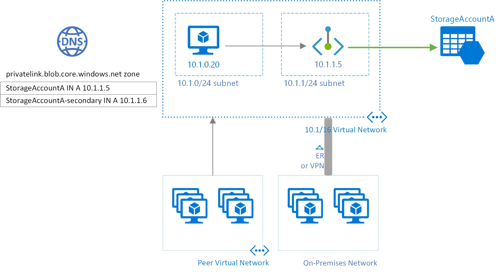

**Note - This is a case study I got from a google search. This may or may not be a real question. I will try my best to not give solutions to problems that might come in the exam, but will try to comment on how I analyzed the problem as I read the case study. If this bothers you, please do not continue.** 

Litware, Inc 

Case Study 

Overview. General Overview Litware, Inc. is a medium-sized finance company.  Litware has a main office in Boston. 

* The current infrastructure is located in a single location. This is a hint that there will not be super complex networking requirements in the use-case. 

Existing Environment. 
* Identity Environment The network contains an Active Directory forest named Litware.com that is linked to an Azure Active Directory (Azure AD) tenant named Litware.com. All users have Azure Active Directory Premium P2 licenses.
	* On-premises has an AD installation. Users and groups are going to be here and authentication / authorization is being handled on-premise using this AD instance. 
	* It looks like they have deployed AD Cloud connect on-premises and are synchronizing the identities from on-premise to the AD in Azure. 
	* Premium P2 licenses are there, so there is no worry on what features they can use since this is the highest level of licensing we can have. 
	
* Litware has a second Azure AD tenant named dev.Litware.com that is used as a development environment. 
	* Looks like this is another AD tenant they have. I think this is just to confuse us. The next statement just reverts back and talks about the production AD instance.
* The **Litware.com tenant** has a conditional access policy named capolicy1. Capolicy1 requires that when users manage the Azure subscription for a production environment by using the Azure portal, they must connect from a **hybrid Azure AD-joined device**. 
	* This means the device is joined to on-premises AD and Azure AD requiring organizational account to sign in to the device.

 Existing Environment. 
* Azure Environment Litware has 10 Azure subscriptions that are linked to the Litware.com tenant.
* Five Azure subscriptions that are linked to the dev.Litware.com tenant. 
* All the subscriptions are in an Enterprise Agreement (EA). 
* The Litware.com tenant contains a custom Azure role-based access control (Azure RBAC) role named Role1 that grants the **DataActions read permission to the blobs and files in Azure Storage.**

Existing Environment. On-premises Environment
* The on-premises network of Litware contains the resources shown in the following table. 

* Hyper-V hosting with Linux machines. 
* Windows OS based server hosting SQL Server and multiple databases under the same SQL Server.

Existing Environment. 
* Network Environment Litware has ExpressRoute connectivity to Azure. 
	* This means that there is connectivity from on-premise data center and the Azure VNETs. Computers can address each other via their IP addresses.

Planned Changes and Requirements. 
Litware plans to implement the following changes: 
* Migrate DB1 and DB2 to Azure. 
	* Dedicated hosts are just for the app layer, the database can be hosted on PaaS solutions, if required.
* Migrate App1 to Azure virtual machines. Deploy the Azure virtual machines that will host App1 to Azure **dedicated hosts**.

Authentication and Authorization Requirements 
Litware identifies the following authentication and authorization requirements:

* Users that manage the production environment by using the Azure portal must connect from a hybrid Azure AD-joined device and authenticate by using Azure Multi-Factor Authentication (MFA). 
	* When there are requirements to make sure that a particular application is guarded by an MFA, the way to achieve that is via conditional access policies. 
* The Network Contributor built-in RBAC role must be used to grant permission to all the virtual networks in all the Azure subscriptions. 
	* This gives us a pretty good hint. The in-built role should be assigned in such a way that it can be applicable to all subscriptions. Since there is no uniqueness to any subscription, we can get away by assigning it to the tenant root management group, and that would inherit to every subscription under it. This is a best practice because even if new subs are added in the future, the same group of people will be authorized to create networking resources in them.
* To access the resources in Azure, App1 must use the managed identity of the virtual machines that will host the app. Role1 must be used to assign permissions to the storage accounts of all the Azure subscriptions. 
	* The virtual machines are hosting the application, and there are no credentials embedded in them. They inherit the roles given to the managed identity assigned to the virtual machines. 
	* Since there are multiple machines (VMs) hosting the application, and need the same access rights, it makes sense to create a user managed identity and assign it to these VMs. The managed identity outlives any specific resource that way, and can be a central conduit to make changes to access rights. 
* RBAC roles must be applied at the highest level possible. 
	* Hint management groups to group subs and assign roles.

Resiliency Requirements 
Litware identifies the following resiliency requirements: 
Once migrated to Azure, DB1 and DB2 must meet the following requirements: 
*  Maintain availability if two availability zones in the local Azure region fail. 
	* Hint. Since it is telling us that we need to be available even if a single region fails, we need to look at SQL options that allow us to deploy the databases in 2 separate regions and have replication between them. There are 2 such options - Active Geo-Replication and Auto Failover groups. 
* Fail over automatically. 
	* Auto-Failover groups only can meet this requirement, Active geo-replication can allow us to manually fail-over.
*  Minimize I/O latency.
	* This is hinting towards having a business critical tier for our databases. The general purpose tier is not going to guarantee us high performance and low latencies asked for. 

App1 must meet the following requirements: - 
* Be hosted in an Azure region that supports availability zones. 
	* This means that we have to pick the regions where we have multiple AZs.
* Be hosted on Azure virtual machines that support automatic scaling. 
	* Since we need to have virtual machines and support autoscaling, we need to deploy virtual machine scale sets to get this in both the regions. 
	* For load balancing across regions we can use traffic manager or Azure Front Door based on the layer-4 or layer-7 requirements.
* Maintain availability if two availability zones in the local Azure region fail.
	* This means that we have to pick regions that have 3 AZs and spawn the VMSS to allow deployments across all the 3 AZs.

Planned Changes and Requirements.

Security and Compliance Requirements 

Litware identifies the following security and compliance requirements: 
* Once App1 is migrated to Azure, you must ensure that new data can be written to the app, and the modification of new and existing data is prevented for a period of three years. 
	* This is hinting towards the use if immutable storage policies. There are 2 types of immutable storage policies. Legal hold and time-based. Since we need to prevent changes for 3 years after the blob was created, a time-based policy makes sense.
	* If we remember from before, we have a RBAC role that has just data reader permissions. We need to change that to allow the data write permissions and then assign that role to the managed identity we create for the VMs hosting the apps. Otherwise the apps can't write to storage.

* On-premises users and services must be able to access the Azure Storage account that will host the data in App1. 
	* This is telling us how to configure our storage accounts. The firewall that is guarding the storage account should allow certain named locations to access the storage. The named locations can include the Boston office where users and services can access this storage.
* Access to the public endpoint of the Azure Storage account that will host the App1 data must be prevented. 
	* Again this tells us that we need to turn off public access to both containers and blobs, and allow the App1 to connect to storage via a private link from the VNET.
	* 
* All Azure SQL databases in the production environment must have Transparent Data Encryption (TDE) enabled. 
	* This is a pretty straight-forward requirement. We need to provision a key-vault in both regions, and deploy a key into it. We can then use it to setup TDE on the database if customer managed keys are required. 
	* If a database is in a geo-replication relationship, both the primary and geo-secondary databases are protected by the primary database's parent server key.
* App1 must not share physical hardware with other workloads. 
	* This requirement has already been taken care of by hosting the workload in a dedicated host infrastructure in both regions.

Business Requirements Litware identifies the following business requirements: 
* Minimize administrative effort. 
	* This can be achieved at the database layer using a managed service.
* Minimize costs. 
	* Use reserved instances for the dedicated hosts to get a multi-year usage discount.