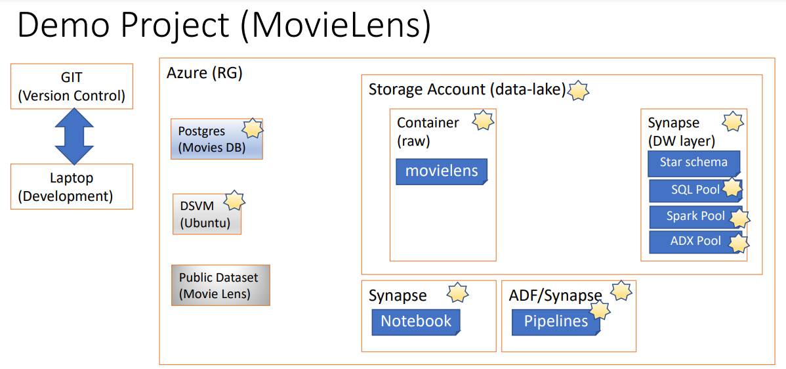
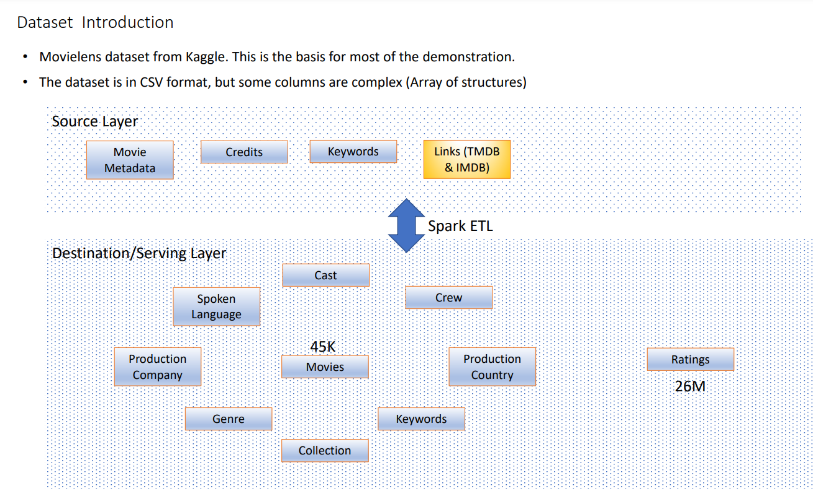
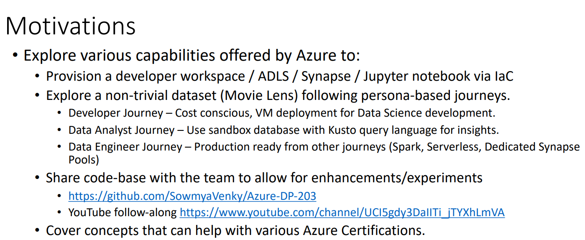

<ul>
<li>
Azure gives us a pre-configured VM to allow us to launch a windows or linux vm with all the data science tools loaded and ready to go. This makes our life very easy to work and experiment, without worrying about python, installs etc. https://docs.microsoft.com/en-us/azure/machine-learning/data-science-virtual-machine/linux-dsvm-walkthrough
</li>
<li>
We can create a VM based on the ubuntu image, and copy the contents present in the wwi-02/ipl folder. This contains a notebook that we can experiment with. 
</li>
<li>
Once the server is launched and scp done, we can hit the jupiter web ui with this url: https://20.225.124.216:8000/
A certificate error is given, but can be ignored. Login with the same username/password we have used to create the VM. I did not use key based ssh, setup password based auth on ubuntu. 
</li>
<li>
Select azureml_py38 as the kernel to use. That has all the plotting libs needed.
</li>

  

  

  

For detailed notes please click <a href="MovieLensDemo.pdf">here</a>

