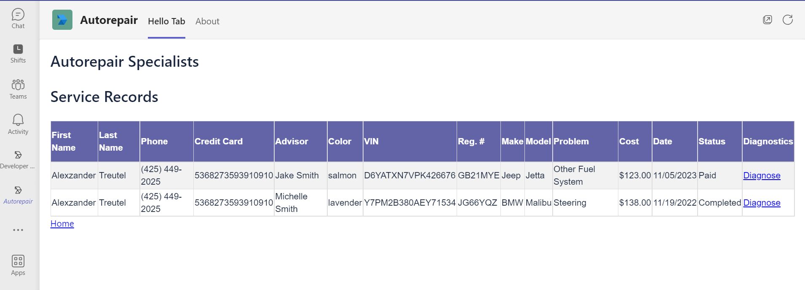

## Sample Autorepair application in teams with Node JS
* This is a sample application we are building to demonstrate how to use a node JS app and make it into a personal application inside teams. This is an entire application built with Node and can be deployed to fit into the UI of teams. This is the least custom route. 
* Please follow the instructions in the Run_Instructions.txt file. 
* This sample is dependent on having docker and running a mysql image in it. 
* There are 2 apps deployed here. One is an API app that can run on port 3000 and can create all the databases, tables and data required for the app to function. The faker library is used to create employees, customers, and service records to simulate customers coming in to get their vehicle repaired. 
* Screen shots for demonstration are below.

