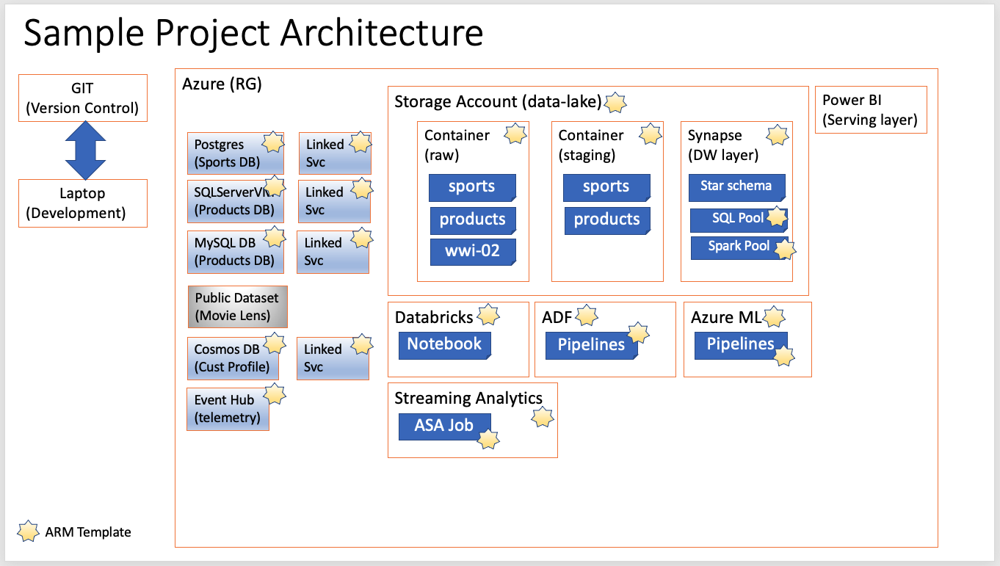

# Azure-DP-203

This project shows some of the experiments we can do to get familiar with the aspects tested on the DP-203 exam. Here are the steps to get the basic stuff provisioned via ARM templates. We can do this a couple of times via the UI to get familiar, but we can save a lot of time by making it create via the ARM templates. 

  

Here are the steps:

1. Create a SQL server database. 
2. Login to the SQL Server database after adjusting the firewall to allow us to connect from our personal IP using SSMS
3. Create the tables and data that is required by using the scripts under sqlserver folder.
4. Create a data factory instance for us
5. Create a storage account with a containers in it.    
6. Write a data factory job to extract the data from the sql server database and put it on the blob storage container.
