I have setup docker on my computer, and started 3 containers running the 3 databases. 

  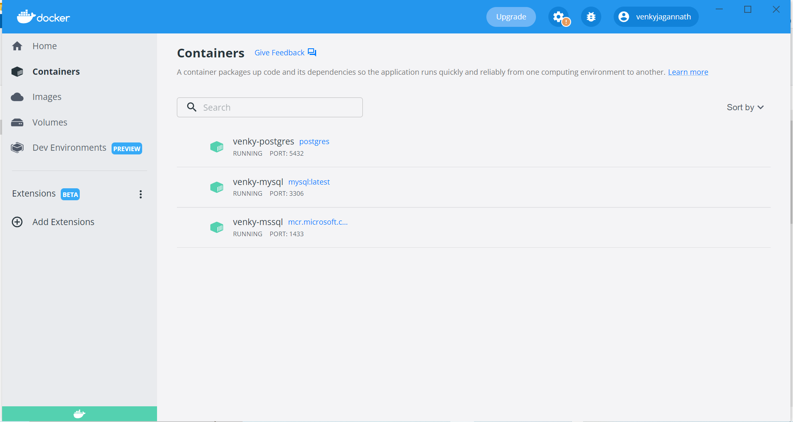

I have installed HammerDB on my computer, and loaded the TPCC schema on all the 3 database containers. After the schema loads, we can simulate multiple users running on the databases. I am running 10 users, against the same dataset, on the same computer to provide an unbiased comparison. 
Here is the MSSQL result:

  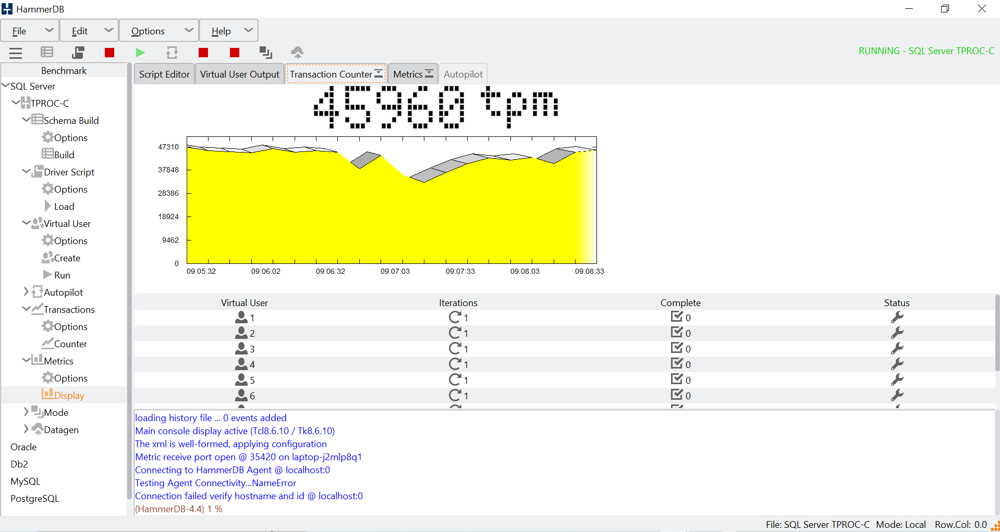

Here is the MYSQL result:

  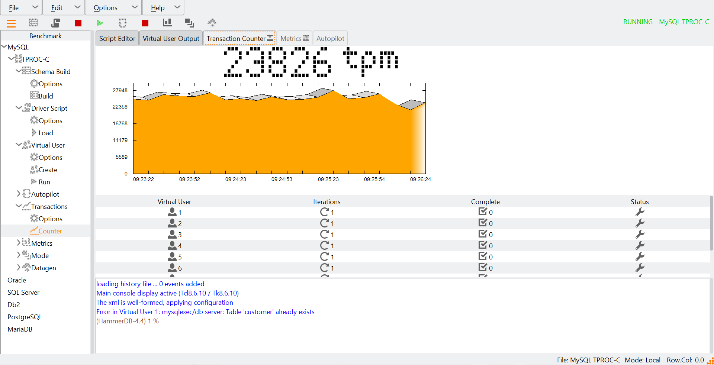

Here is the Postgres result:

  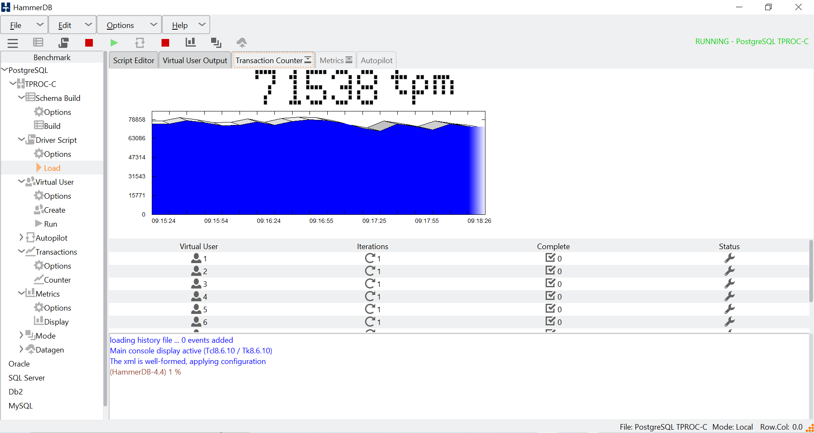

Let is create the databases on Azure. Create the MSSQL database using the ARM template, by executing 1002-Create-MYSQLDB.ps1. After provisioning, make sure to go to connection settings, and allow connection from the local latpop by adding the IP address. I have tried to hit this small server from local and from a VM inside a VNET and the performance numbers were very similar. Here is the chart of how it performs with 50 users, 500 ms delay between queries. 

  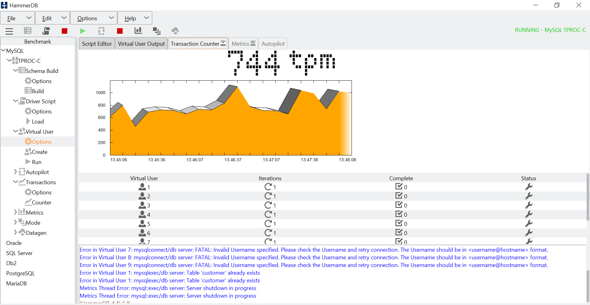

Now the same tests with a Postgres database.

  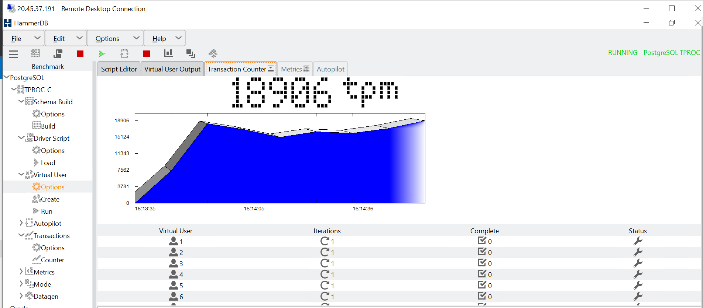

  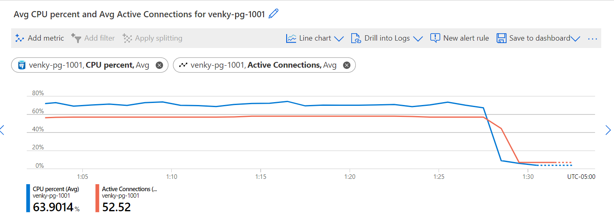

Now we scale up the number of CPUs from 2 vcore to 32 vcore.
MYSQL

  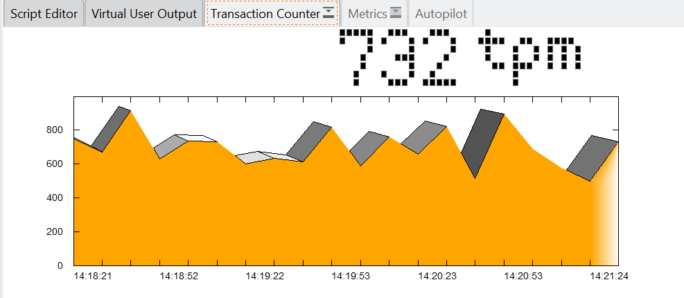

  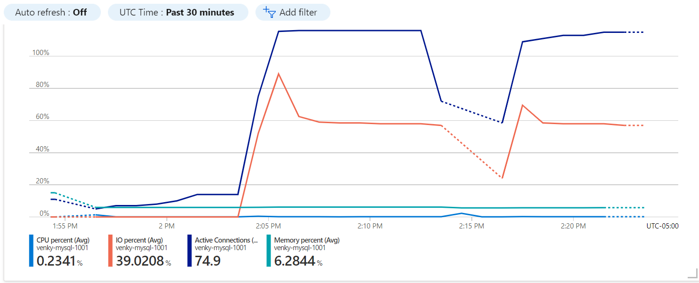

Postgres. Note how the CPU stays pretty put close to 100% for the entire 1/2 hr of the test. 
Getting around 24K transactions per minute. 

  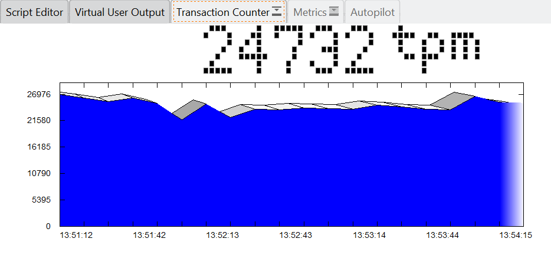

  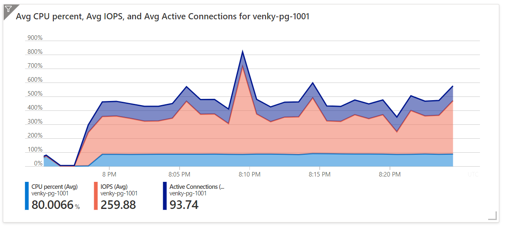

Kubernetes (AKS) deployment  

  

  

  

