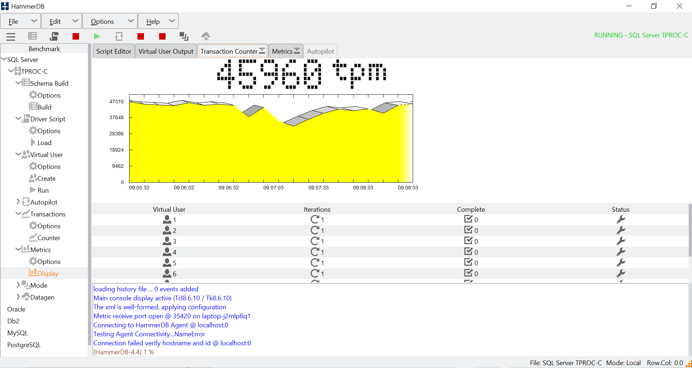
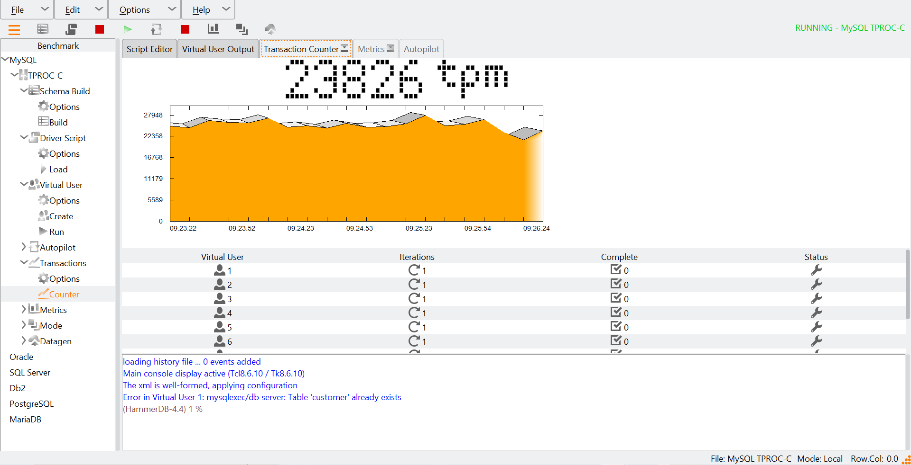
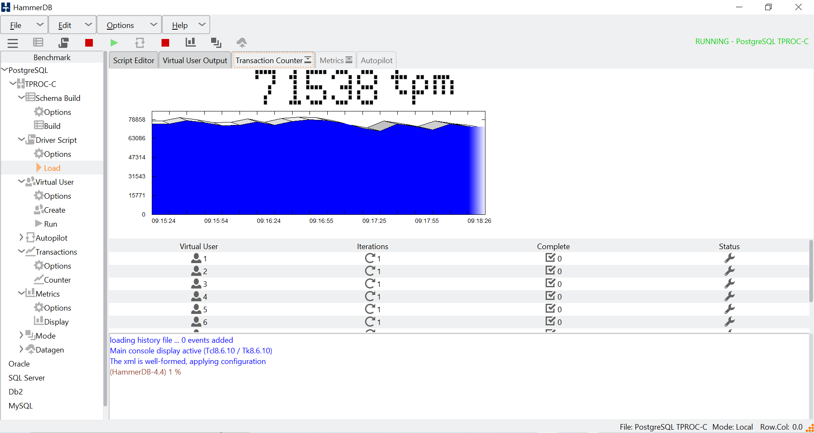

I have setup docker on my computer, and started 3 containers running the 3 databases. 

  

I have installed HammerDB on my computer, and loaded the TPCC schema on all the 3 database containers. After the schema loads, we can simulate multiple users running on the databases. I am running 10 users, against the same dataset, on the same computer to provide an unbiased comparison. 
Here is the MSSQL result:

  

Here is the MYSQL result:

  

Here is the Postgres result:

  

