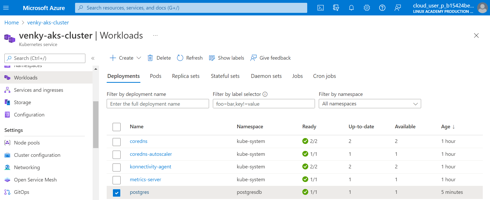
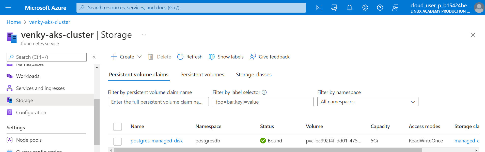
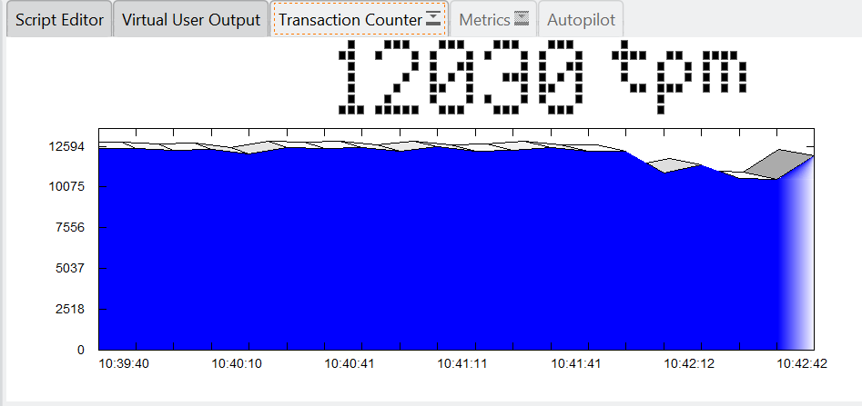
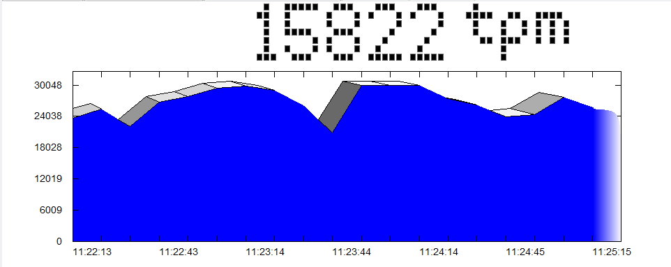
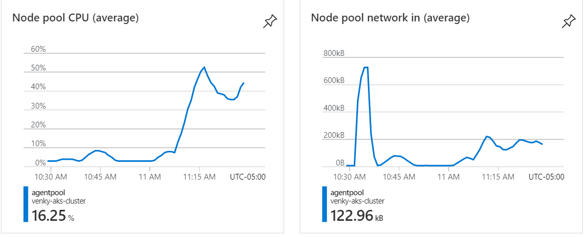

This experiment is to determine whether databases are a good fit to run inside a Kubernetes cluster. We will try different database engines, deployed in multiple ways:

<ul>
<li>Deploy MSSQL, MYSQL, and Postgres in docker running locally.</li>
<li>Deploy MySQL inside Azure with Basic configuration (2 vCPUs).</li>
<li>Deploy MySQL inside Azure with General Purpose configuration (32 vCPUs).</li>
<li>Deploy Postgres inside Azure with Basic configuration (2 vCPUs).</li>
<li>Deploy Postgres inside Azure with General Purpose configuration (32 vCPUs).</li>
<li>Deploy Postgres inside an AKS cluster with a SSD persistent volume.</li>
</ul>

For each of these cases, we will fire HammerDB and test the TPCC workload with 10 users, and expand it to 100 users. 

<b>Summary</b>
<table border="1" width="100%">
<tr>
<td>Option</td>
<td>Finding</td>
</tr>
<tr>
<td>Docker Containers</td>
<td>The databases performed amazing. Postgres was the fastest among the three engines, with MSSQL being second, and MYSQL being the worst among the three. The memory used and CPU were also not high. Even with 10 users, the tps were pretty high as shown below. Since there was no network or I/O latency, the database engines, by themselves are pretty good when handling this workload.</td>
</tr>
</table>
I have setup docker on my computer, and started 3 containers running the 3 databases. 

  

I have installed HammerDB on my computer, and loaded the TPCC schema on all the 3 database containers. After the schema loads, we can simulate multiple users running on the databases. I am running 10 users, against the same dataset, on the same computer to provide an unbiased comparison. 
Here is the MSSQL result:

  

Here is the MYSQL result:

  

Here is the Postgres result:

  

Let is create the databases on Azure. Create the MSSQL database using the ARM template, by executing 1002-Create-MYSQLDB.ps1. After provisioning, make sure to go to connection settings, and allow connection from the local latpop by adding the IP address. I have tried to hit this small server from local and from a VM inside a VNET and the performance numbers were very similar. Here is the chart of how it performs with 50 users, 500 ms delay between queries.

 

  

Now the same tests with a Postgres database.

  

  

Now we scale up the number of CPUs from 2 vcore to 32 vcore.
MYSQL

  

  

Postgres. Note how the CPU stays pretty put close to 100% for the entire 1/2 hr of the test. 
Getting around 24K transactions per minute. 

  

  

Kubernetes (AKS) deployment

  

  

  

  

Increasing the user load to 100 users.

  

  

